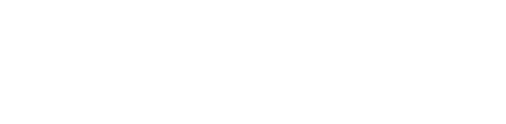

# learning-quest "El camino a las estrellas :rocket: :star2:"

Este repositorio tiene como finalidad documentar el stack (conjunto de tecnologías) que se usa en Latam Earth CA, y contener un conjunto de pruebas técnicas para comprobar el nivel de conocimiento de los candidatos a algún puesto en el área de desarrollo de software.

> NOTE: Todas las tecnologías debes ser usadas con typescript

## Básicas para todos los Dev

| nombre | version |
|----------|-------|
| [typescript](https://www.typescriptlang.org/)    | ^5 |
| [zod](https://www.npmjs.com/package/zod)    | ^3 |
| [vscode](https://code.visualstudio.com/)    | ^1 |

## ¿Deseas postularte, dinos en qué área ?

> ***NOTE:*** Si presentas un CV con proyectos que ya manejen nuestro stack puedes presentarnos un conjunto de proyectos donde se evidencie ese conocimiento.

- ### [Front](./front/stack.md)

- ### [Back](./back/stack.md)
